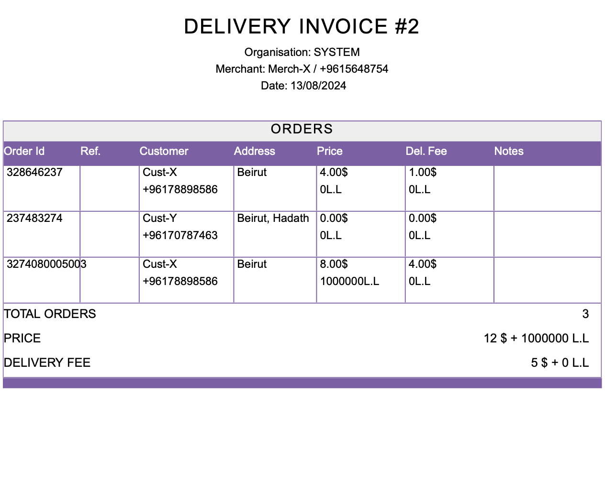

## How it works

When a driver delivers a group of orders and pays you the collected money, you will still need to pay the required amount to merchants.

Until you pay the amount to merchants, orders will have the state **Invoiced For Driver**, which means that the driver has paid you the collected money but you still didn't pay the required amount to merchants.

Once you pay merchants their money, you can generate an invoice (for delivery or cancellation) to mark the orders as finalised and fully paid to merchants.

This action will put the orders in the final state, **Invoiced For Merchant**

## What is included in a merchant's invoice

A merchant's invoice includes a table of delivered (or cancelled) orders.

At the bottom of the table, you will find a summary that indicates the following information:
- **Total Orders**: number of orders included in the invoice.
- **Price**: is the total amount of money that the merchant should get paid.
- **Delivery Fee**: is the amount of money that you should be paid as a delivery organisation for delivering (or cancelling) these orders.

<Tip>
The **Notes** column contains what is set in the order as a **Public Note**.

This can be useful for exchanged orders; setting the public note to **exchange** will result in including this in the notes column of the invoice.
</Tip>

Here is an example:

In the example above, the driver has collected 17$ + 1000000 L.L, and should keep 5$ + 20000 L.L of them as a delivery commission.

At the end, you will receive the difference (i.e. 12$ + 980000 L.L).

## How to generate an invoice

Navigate to the [accounting page](https://parceltracer.app/accounting) on parcel tracer.

Search for the merchant by typing in his name or phone number.

This will open a view that includes three tabs:
- **Cancelled Orders**: a table showing orders associated to this merchant that were **cancelled**.
- **Delivered Orders**: a table showing orders associated to this merchant that were **delivered** and are still **invoiced for driver**.
- **Invoices**: a table showing the merchant invoices that are already generated for this merchant.

<Warning>

Delivered orders should be invoiced for the driver before you invoice them for merchants.\
The reason is that you can't pay your merchant if your driver hasn't yet paid you the collected amount of money.\

Cancelled orders don't necessarily need to be invoiced for driver before you invoice them for merchants.\
The reason is that a merchant/customer might cancel an order before it's assigned to a driver.
</Warning>

To generate an invoice, select the orders for which which you paid your merchant from the **Cancelled Orders** or **Delivered Orders** tabs, then click the **CREATE INVOICE** button.

Once you click the **CREATE INVOICE** button, you will automatically be redirected to the **Invoices** tab and the orders will become in the **Invoiced For Merchant** payment state.

The video below shows an example where we create 2 invoices for a driver named **Driver-X**.

The first invoice is a cancellation invoice, and the second one is a delivery invoice.

<iframe 
  width="100%" 
  height="400" 
  src="https://www.youtube.com/embed/KFx370vIMKk" 
  title="YouTube video player" 
  frameborder="0" 
  allow="accelerometer; autoplay; clipboard-write; encrypted-media; gyroscope; picture-in-picture" 
  allowfullscreen>
</iframe>

<Tip>

When you create an invoice for your merchant, the created invoice will automatically be visible in the merchant's account.

Your merchants can view invoices and download them at their own convenience.
</Tip>

<Tip>

You can also add notes to your invoices by clicking the pen icon in the notes column of the invoices table.

</Tip>