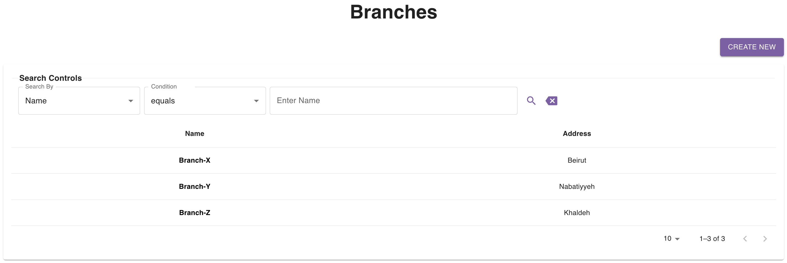
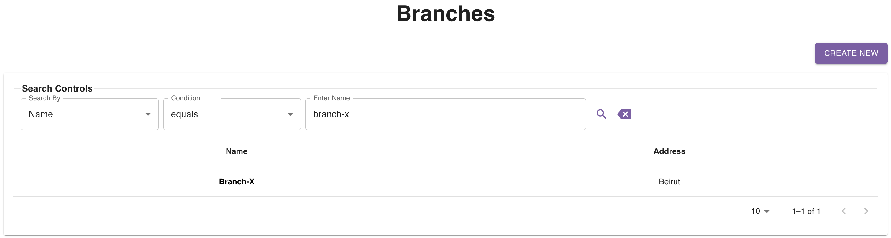
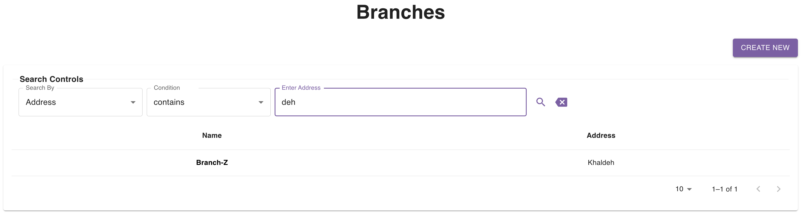

## Introduction

The [branches page](https://parceltracer.app/branches) provides you with a table listing all your branches.

This table is also supported with a search section so that you can narrow down the branch list based on specific criteria.

## Pagination

By default, the table shows you only 10 branches at a time.\
You can check the next (or previous) 10 branches by clicking the right (or left) arrow at the bottom right corner of the table.\
You can also change the number of branches that the table shows in 1 page by tweaking the page size at the bottom right corner.\
You are not able to view more than 250 branches at the same time.

The pagination controls can be found at the bottom right corner of the branches table as you can see in the figure above.

## Search Controls

You are capable of searching based on the following fields:
- Name
- Address

### Exact Search Example
As an example, if you want to look for a branch with a specific name, say `Branch-X`, you can set the following:
- Search By: `Name`
- Condition: `equals`
- Enter Phone: `Branch-X`

Here is a figure showing this:

### Partial Search Example

As an example, if you want to look for branches whose address contains `deh`, you can do the following:
- Search By: `Address`
- Condition: `contains`
- Enter Phone: `deh`

Here is a figure showing this:
