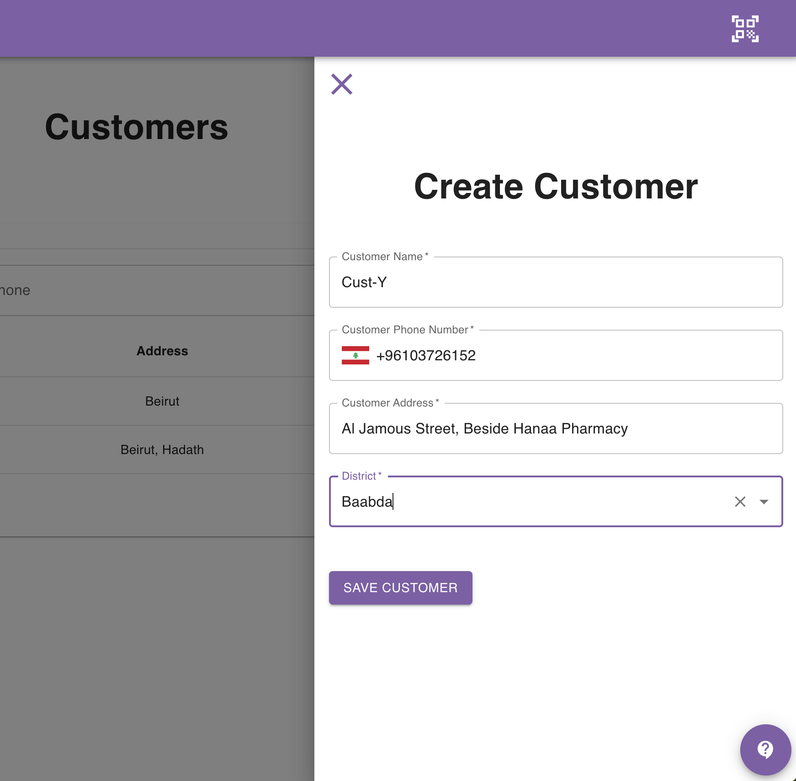

## Introduction

You can create a new customer in one of 2 ways:
- From the **Customers** page
- From the **Create Order** form

The following 2 sections show you how this can be done.

## Create Customer From Customers Page

Navigate to the customers page.

Click the **Create New** button.

A side drawer will open from the right.

Fill in the customer information and click save.

This can be seen in the image below:

## Create Customer Inline In Order Form

When you create an order, you can directly create a customer inline by clicking the ➕ sign in the customer field.

Clicking this sign will open a window and ask you for the custom information.

As you fill the customer data and click save, the customer will be created and its data will be directly filled automatically in the order form.

The video below shows an example of how this can be done.

<iframe 
  width="100%" 
  height="400" 
  src="https://www.youtube.com/embed/H1voGAK1OYc" 
  title="YouTube video player" 
  frameborder="0" 
  allow="accelerometer; autoplay; clipboard-write; encrypted-media; gyroscope; picture-in-picture" 
  allowfullscreen>
</iframe>

