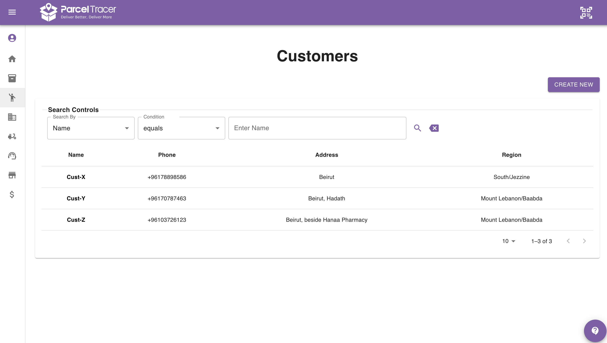
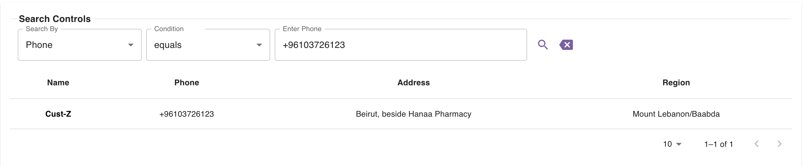
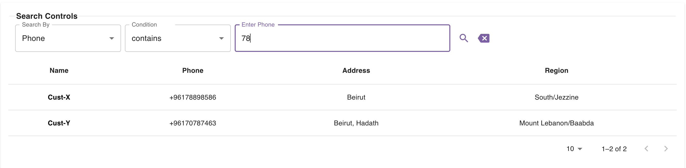

## Introduction

The customers page provides you with a table listing all your customers.

This table is also supported with a search section so that you can narrow down the customer list based on specific criteria.

## Pagination

By default, the table shows you only 10 customers at a time.\
You can check the next (or previous) 10 customers by clicking the right (or left) arrow at the bottom right corner of the table.\
You can also change the number of customers that the table shows in 1 page by tweaking the page size at the bottom right corner.\
You are not able to view more than 250 customers at the same time.

The pagination controls can be found at the bottom right corner of the customers table as you can see in the figure above.

## Search Controls

You are capable of searching based on the following fields:
- Name
- Phone
- Address

### Exact Search Example
As an example, if you want to look for a customer with a specific phone number, say +96103723714, you can set the following:
- Search By: `Phone`
- Condition: `equals`
- Enter Phone: `+96103726123`

Here is a figure showing this:

### Partial Search Example

As an example, if you want to look for customers whose phone number contain `78`, you can do the following:
- Search By: `Phone`
- Condition: `contains`
- Enter Phone: `78`

Here is a figure showing this:

