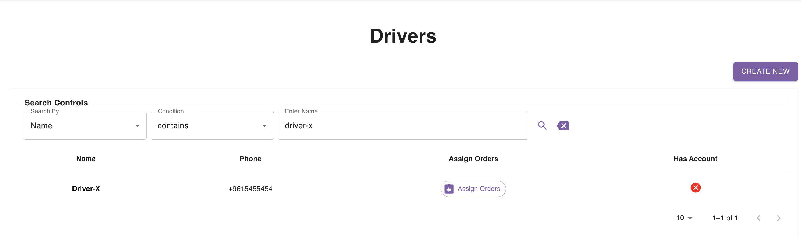
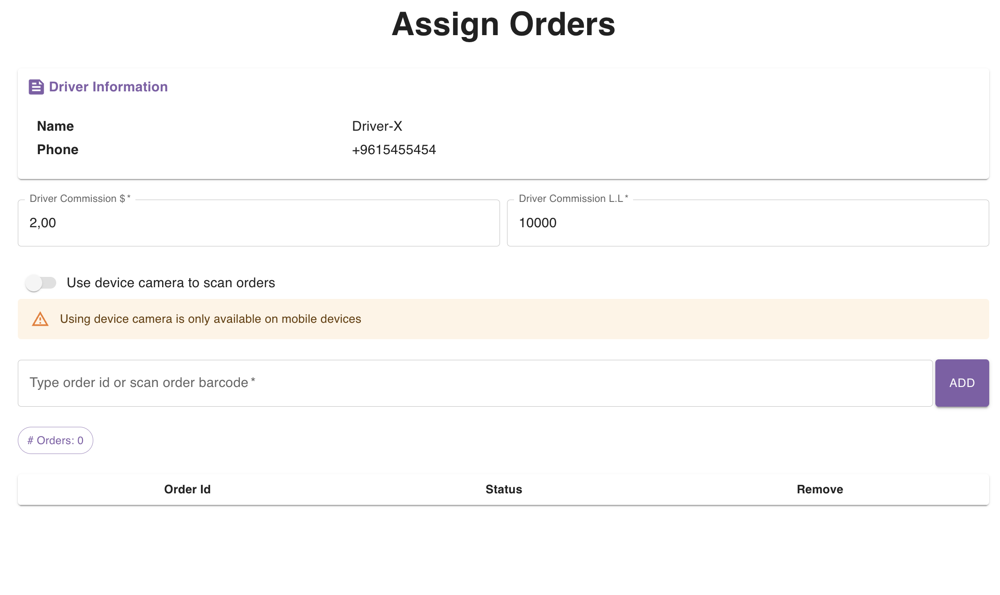
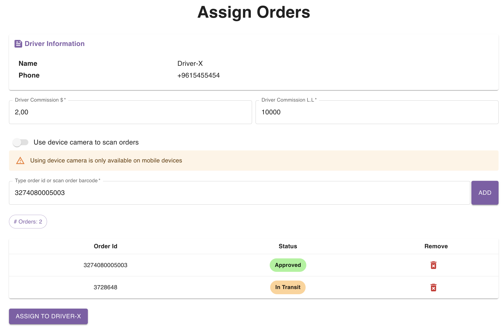
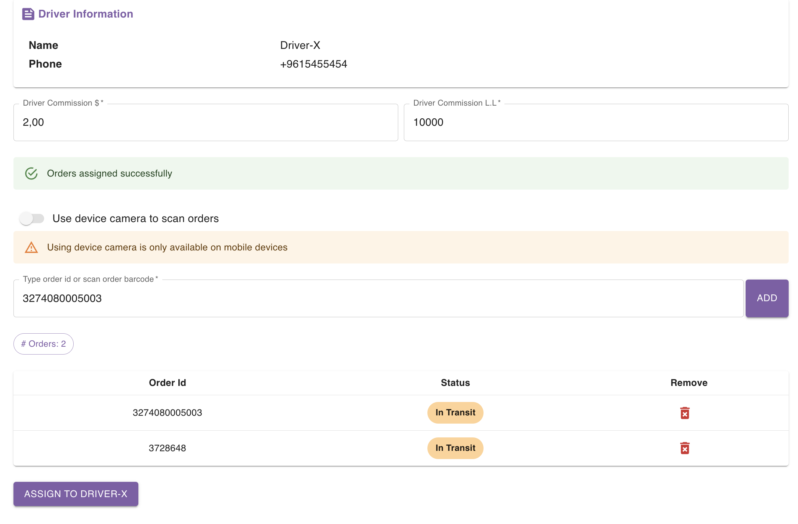

## Introduction

You can assign orders to drivers in 2 ways:
- Directly from the orders page.
- From the **Assign Orders** page.

The following 2 sections explain in details how this can be done.

## Using Orders Page

Please refer to [this](/user-guides/for-delivery-companies/orders/listing-orders#assign-driver) section for more details about how you can assign orders to a driver from the orders page.

## Using **Assign Orders** Page

You should first head to the [drivers page](https://parceltracer.app/drivers) and spot the driver you want to assign orders to.

For example, let's search for the driver with the name `Driver-X`:

<Warning>
If you have an **Employee** account and you don't see the **Assign Orders** button, it means that your admin didn't grant you the permission to assign orders to drivers.\
You can request this permission from the admin.
</Warning>

You can then click the **Assign Orders** button.\
This will take you to the following page:

You see that the driver commission is automatically set to the default values (in this case, the driver commission is `2$+10000L.L`).\
You can override these values if you wish to.

To assign orders to this driver, you should type in the order id's (or scan the barcodes using a barcode scanner).\
As you add the order id's, the orders will be filled in the table below as you can see in the following figure.

If you scanned an order by mistake, you can remove it from the collection by click then bin button under the **Remove** column.

When you are done adding the orders, you can finally click the button below the table to assign the orders to the driver.

<Warning>

You are not allowed to assign orders to a driver if:
- one of the orders is not approved yet
- one of the orders is already **Invoiced For Driver** or **Invoiced For Merchant**

Once you assign orders to a driver, the delivery state of the orders will become **In Transit**.
</Warning>

