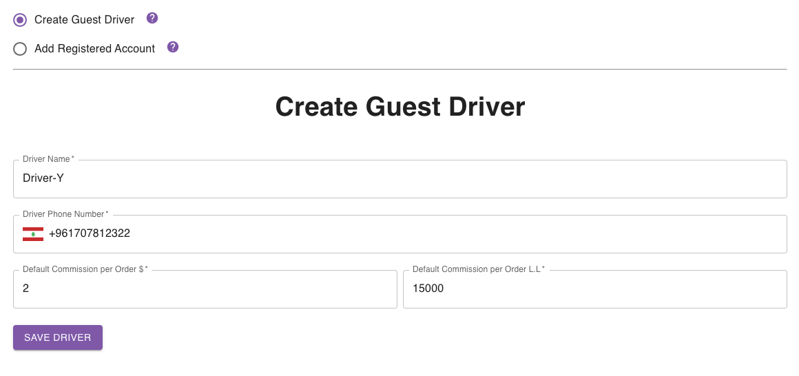
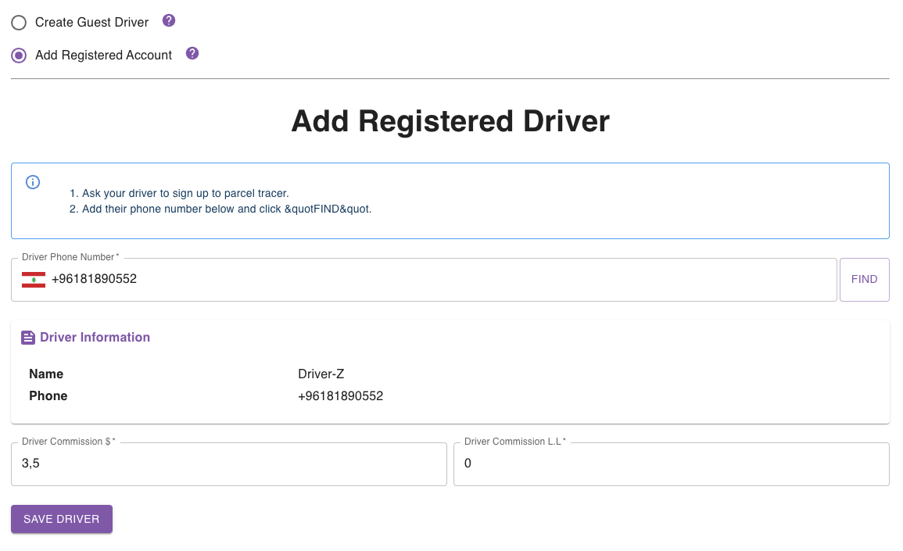

## Introduction

You can have 2 types of drivers in your organisation:
- **Guest Driver**: has no access to the system at all.
- **Registered Driver**: has a limited access to the system.

Any driver, whether guest or registered, is identified by the following information:
- Name
- Phone Number
- Delivery Commission in L.L
- Delivery Commission in $.

## Creating A New Driver

To create a new driver, head to the [drivers page](https://parceltracer.app/drivers).

Click the **Create New** button, which will open a side drawer to fill in the driver information.

You should then choose whether you want to create a guest driver or to add a registered account.

### Creating a Guest Driver

To create a guest driver, you should simply specify the name, number, and default delivery commission in both currencies.

You can see an example in the following figure:

### Adding a Registered Driver

To add a registered driver, the driver should already have an account on [parceltracer](https://parceltracer.app/).

If they don't have an account yet, they can sign up by following the instructions here.

Once your driver has signed up to [parceltracer](https://parceltracer.app/), you simply need to specify his phone number, and click **Find** as shown in the figure below:

