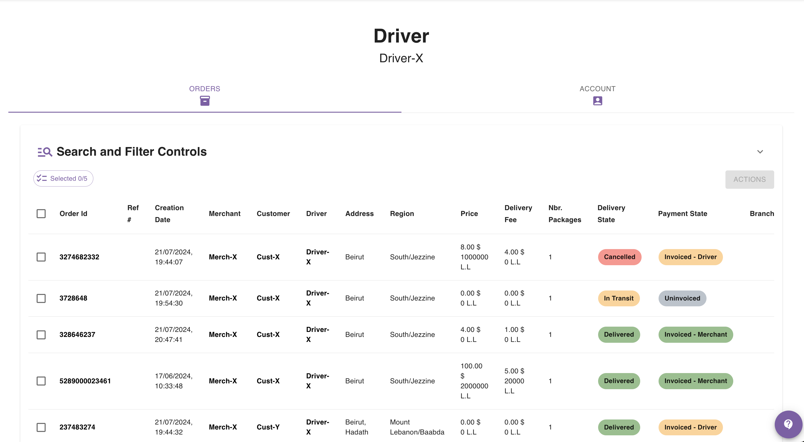
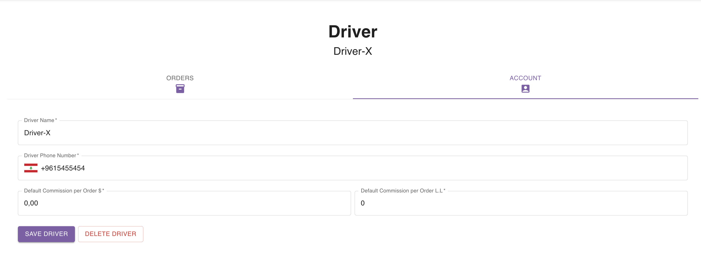

## Driver Details Page

Driver details page shows you exhaustive information about a driver.

This page is split into 2 views:
- **Orders**: shows a table including orders assigned to the related driver only.
- **Account**: form that allows you to delete the driver, or modify the his details.

## Orders View

Here is an example of the orders view:

You can learn more about interacting with orders tables [here](/user-guides/for-delivery-companies/orders/listing-orders).
## Account View

<Warning>
Deleting a driver will result in deleting all orders related to the deleted driver.
</Warning>

Here is an example of the account view:

