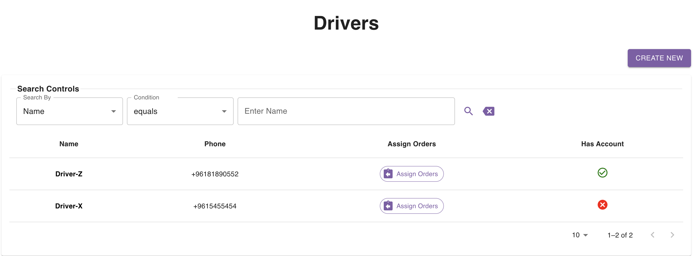
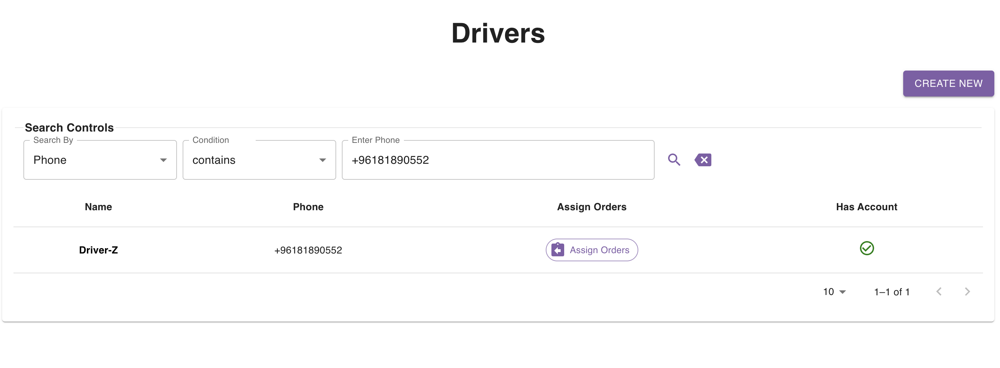
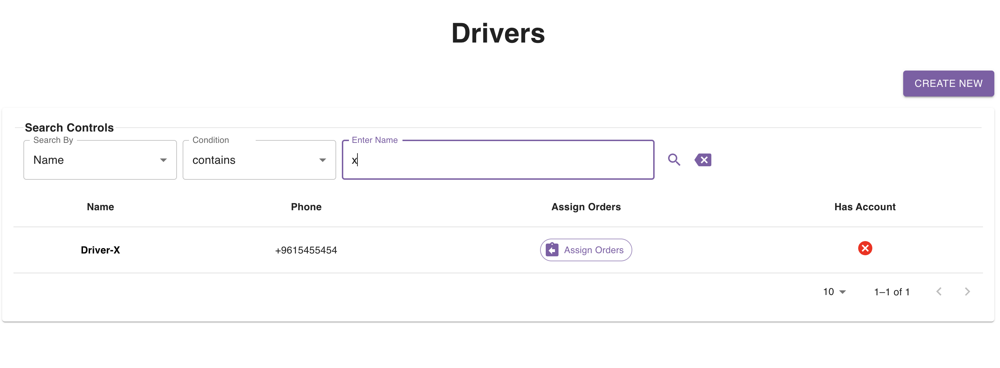

## Introduction

The [drivers page](https://parceltracer.app/drivers) provides you with a table listing all your drivers.

This table is also supported with a search section so that you can narrow down the driver list based on specific criteria.

As you can see in the table below, the **Has Account** column shows for each driver whether they have a password/account or not (i.e. guest or registered).

## Pagination

By default, the table shows you only 10 drivers at a time.\
You can check the next (or previous) 10 drivers by clicking the right (or left) arrow at the bottom right corner of the table.\
You can also change the number of drivers that the table shows in 1 page by tweaking the page size at the bottom right corner.\
You are not able to view more than 250 drivers at the same time.

The pagination controls can be found at the bottom right corner of the drivers table as you can see in the figure above.

## Search Controls

You are capable of searching based on the following fields:
- Name
- Phone

### Exact Search Example
As an example, if you want to look for a driver with a specific phone number, say +96181890552, you can set the following:
- Search By: `Phone`
- Condition: `equals`
- Enter Phone: `+96181890552`

Here is a figure showing this:

### Partial Search Example

As an example, if you want to look for drivers whose name contains `z`, you can do the following:
- Search By: `Name`
- Condition: `contains`
- Enter Phone: `z`

Here is a figure showing this:

