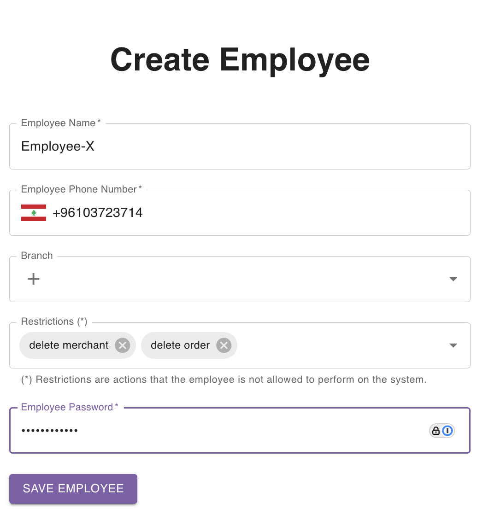

import ReactPlayer from 'react-player'

## Create Employee From Employees Page

Navigate to the [employees page](https://parceltracer.app/employees).

Click the **Create New** button.

A side drawer will open from the right.

Fill in the employee information and click save.

As an example, let's create an employee named **Employee-X** with phone number `03723714`.\
Let's also remove the permissions to delete merchants and orders.\
This means that the employee that will be created will not be allowed by the system to delete any merchant or order.\
If the employee tries to do so, the action will be blocked by the system.

The figure below shows how the employee form is filled with the employee data:

