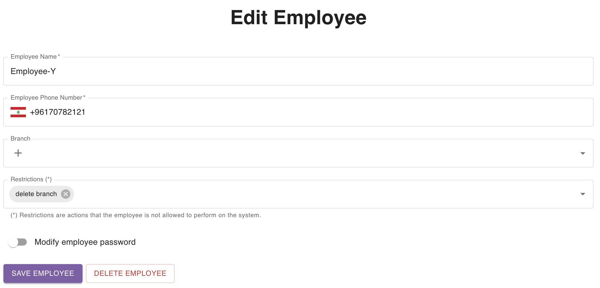

## Employee Details Page

Employee details page includes a form that allows you to modify the employee data, or delete their account completely.

This can be seen in the figure below:

<Tip>

If you change the permissions of an employee, the changes will instantly take effect by the system.

If the employee still can't see the changes reflected in their account, you can ask your employee to log out and then login again.

As an example, if your employee was restricted from modifying order data, and you've just removed this restriction, your employee might still not see the **Modify Order** button. If they logout and then login again, the button will be enabled.

</Tip>

<Warning>
**IMPORTANT**: If you, however, added recently a restriction for modifying order data to one of your employees, then even if the **Modify Order** button is still enabled, they will not be able to modify the order data.
</Warning>
