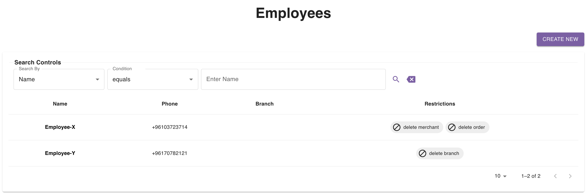
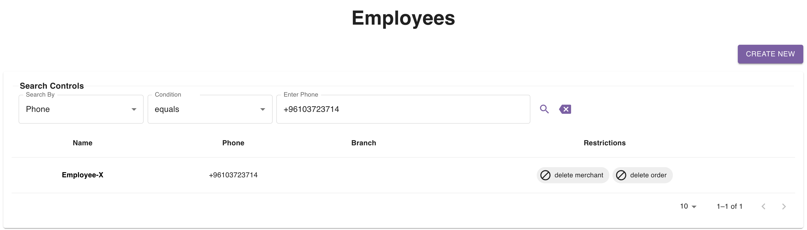
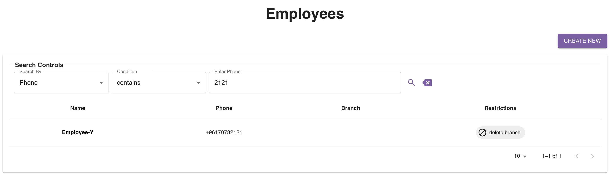

## Introduction

The [employees page](https://parceltracer.app/employees) provides you with a table listing all your employees.

This table is also supported with a search section so that you can narrow down the employee list based on specific criteria.

As you can see in the table below, the **Restrictions** column shows for each employee what actions are restricted on their account.

## Pagination

By default, the table shows you only 10 employees at a time.\
You can check the next (or previous) 10 employees by clicking the right (or left) arrow at the bottom right corner of the table.\
You can also change the number of employees that the table shows in 1 page by tweaking the page size at the bottom right corner.\
You are not able to view more than 250 employees at the same time.

The pagination controls can be found at the bottom right corner of the employees table as you can see in the figure above.

## Search Controls

You are capable of searching based on the following fields:
- Name
- Phone

### Exact Search Example
As an example, if you want to look for a employee with a specific phone number, say +96103723714, you can set the following:
- Search By: `Phone`
- Condition: `equals`
- Enter Phone: `+96103723714`

Here is a figure showing this:

### Partial Search Example

As an example, if you want to look for employees whose phone number contain `2121`, you can do the following:
- Search By: `Phone`
- Condition: `contains`
- Enter Phone: `2121`

Here is a figure showing this:
