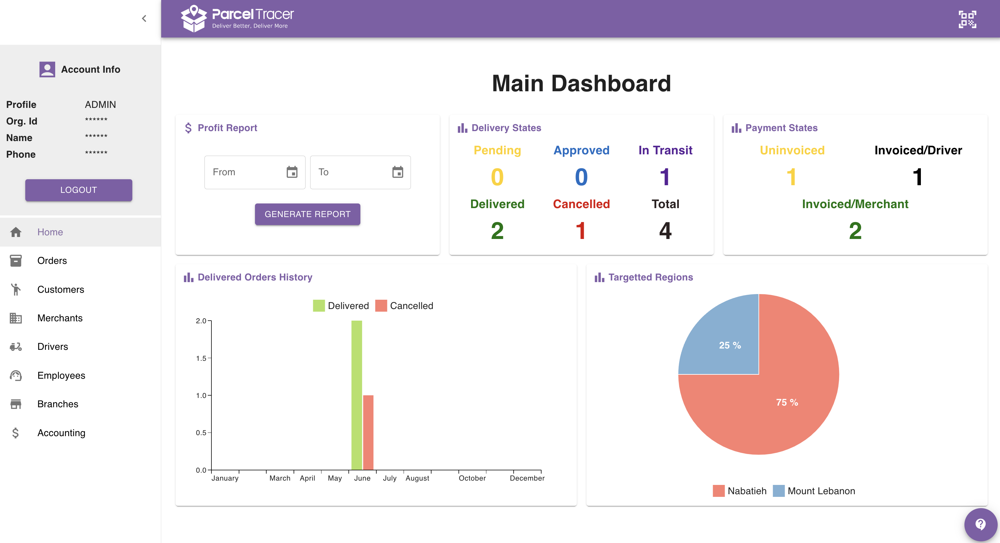

import ReactPlayer from 'react-player'

<Warning>

### **Attention**
The Home Page is only accessible to organisation accounts.  
If you are an employee, kindly skip to the next page.

</Warning>

## Introduction

The home page represents a bird's-eye view to the status of all delivery operations in your company.

It includes six widgets:
- Profit report
- Delivery States
- Payments States
- Delivered Orders History
- Targetted Regions

Here is how it would look like:

The next sections explain what each widget means and how it can be useful to monitor your delivery company.

## Profit Report

The profit report allows you to extract a pdf document that summarises the profit of the company over a specific period of time.

To generate a profit report, specify the start and end date, then click **GENERATE REPORT**\
As soon as the report is generated, you will see a download button which you can click to download and view the profit report.

You can download a sample report from [here](https://drive.google.com/uc?export=download&id=1r2SY-PHSIH2BTP2wZZzHXkhsxB7lWOoI).

<iframe 
  width="100%" 
  height="400" 
  src="https://www.youtube.com/embed/YIqGwT76558" 
  title="YouTube video player" 
  frameborder="0" 
  allow="accelerometer; autoplay; clipboard-write; encrypted-media; gyroscope; picture-in-picture" 
  allowfullscreen>
</iframe>

This report includes 3 pages.

### General Information Page

This page contains three sections.

The first section describes the orders that were delivered or cancelled over the selected period.\
The description includes the following:
- Number of orders
- Total Price: the sum of merchant's price of each order. 
- Total Delivery Fee: the sum of all delivery fees on all the orders.
- Total Driver Commission: the sum of all driver commission on all orders.
- Net Profit: how much profit you will get from these orders once payments are fully finalised. This is basically `Total Delivery Fee - Total Driver Commission`

The second section contains the same information included in the first section, but it only considers orders that were delivered on the selected period.

The third section contains the same information included in the first section, but it only considers orders that were cancelled on the selected period.

### Delivered Orders Page

This page gives more insights about the delivered orders.

It shows 3 histograms:
- Histogram 1: shows the number of uninvoiced, driver-invoiced and merchant-invoiced orders.
- Histogram 2: shows the total price, total delivery fee, and total driver commission for uninvoiced, driver-invoiced and merchant-invoiced orders separately. (Currency is $)
- Histogram 3: same as histogram 2, but currency is L.L.

### Cancelled Orders Page

The last page considers only cancelled orders, and shows the same information as in the delivered orders page.

## Delivery States

This section shows the number of orders in each delivery state.

For a deeper explanation about the different delivery states, refer to [this](https://docs.parceltracer.app/docs/user-guide/user-guide/for-delivery-organisations/orders/intro-to-orders#delivery-states) section.

## Payment States

This section shows the number of orders in each payment state.

For a deeper explanation about the different payment states, refer to [this](https://docs.parceltracer.app/docs/user-guide/user-guide/for-delivery-organisations/orders/intro-to-orders#payment-states) section.

## Delivered Orders History

This is a histogram that shows the number of delivered/cancelled orders in each month of the current year.

## Targetted Regions

This is a pie chart that shows the percentage of orders going to each district/region.

