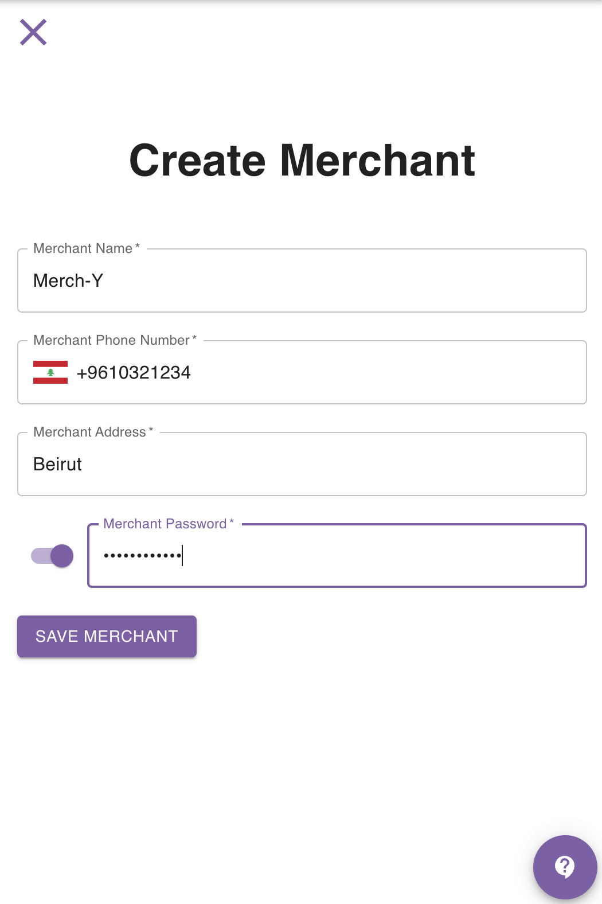

import ReactPlayer from 'react-player'

## Introduction

You can create a new merchant in one of 2 ways:
- From the **Merchant** page
- From the **Create Order** form

The following 2 sections show you how this can be done.

## Create Merchant From Merchants Page

Navigate to the [merchants page](https://parceltracer.app/merchants).

Click the **Create New** button.

A side drawer will open from the right.

Fill in the merchant information and click save.

This can be seen in the image below:

## Create Merchant Inline In Order Form

When you create an order, you can directly create a merchant inline by clicking the ➕ sign in the merchant field.

Clicking this sign will open a window and ask you for the merchant information.

As you fill the merchant data and click save, the merchant will be created and its data will be directly filled automatically in the order form.

The video below shows an example of how this can be done:

<iframe 
  width="100%" 
  height="400" 
  
  src="https://www.youtube.com/embed/W1a-7AwVt78" 
  title="YouTube video player" 
  frameborder="0" 
  allow="accelerometer; autoplay; clipboard-write; encrypted-media; gyroscope; picture-in-picture" 
  allowfullscreen>
</iframe>
