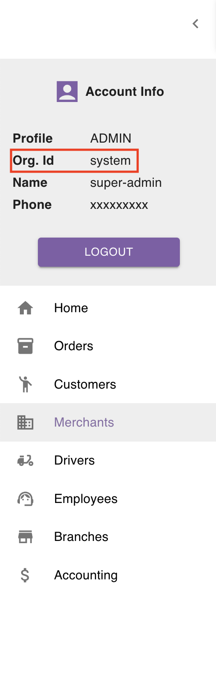

## What is a Merchant

In the simplest terms, a `Merchant` is an order's sender.

Each merchant should have a unique phone number.

A merchant is described by the following information:
- Name
- Phone number
- Address
- Password **[Optional]**

## Merchant's Password

As mentioned in the previous section, assigning a password to a merchant is optional.

When a password is assigned to a merchant, the merchant can login to the system using:
- phone number
- organisation id
- password

If you are not sure what your organisation id is, you can find it in the left sidebar in the account section as you can see below:

When logged in, the merchant will have limited access to the system.

They will be able to:
- place orders
- modify/delete orders that are pending approval
- copy tracking links
- view invoices

<Tip>

You can change the merchant's password at any time.\
You can add a password to a merchant at any time.

</Tip>