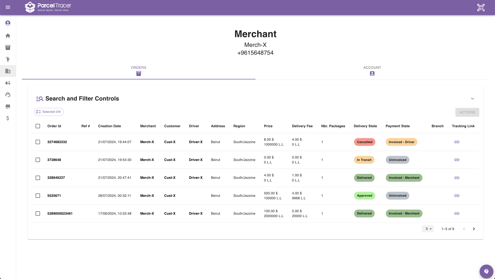
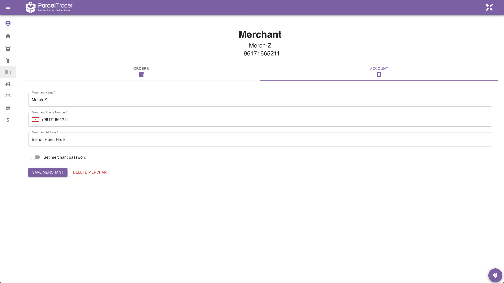

## Merchant Details Page

Merchant details page shows you exhaustive information about a merchant.

This page is split into 2 views:
- **Orders**: shows a table including orders assigned to the related merchant only.
- **Account**: form that allows you to delete the merchant, or modify the his details, including modifying the password.

## Merchants View

Here is an example of the orders view:

You can learn more about interacting with orders tables [here](https://docs.parceltracer.app/docs/user-guide/user-guide/for-delivery-organisations/orders/listing-orders).

## Account View

<Warning>Deleting a merchant will result in deleting all orders related to the deleted merchant.</Warning>

Here is an example of the account view:

