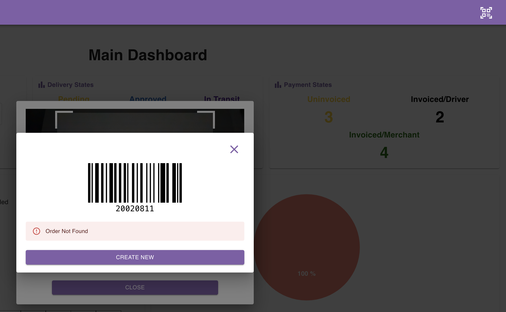

## Introduction

It is possible to create a new order by filling the create order form.

You also have the barcode scanning feature at your disposal to speed up filling the order ID and/or reference number.

<Tip>

### Hint

You can attach a barcode scanner device to your laptop and scan barcodes on the fly!  
If you wish to obtain a laser barcode scanner, don't hesitate to contact us.

</Tip>

## Filling An Order Form

Navigate to the [orders page](https://parceltracer.app/orders) in the app and click the **CREATE NEW** button.

This will open a side drawer from the right and show you a form that you can use to fill the order data.

Here are some useful tips:

- To search for a customer or merchant, you can start by typing their name or phone number.
- If the order is for a new customer (or merchant), you can click the plus sign to add the customer (or merchant) information.
- The address and district will be automatically filled when you choose the customer, but you can still change them if needed.
- When the order is created, all form fields are cleared, except for the merchant field so that it is easy for you to create multiple orders for the same merchant.
- You can click the scan icon in the order ID (or reference number) field to use your phone camera to scan a barcode and automatically fill the field.

The following video shows an example of how the form can be filled.

<iframe 
  width="100%" 
  height="400" 
  src="https://www.youtube.com/embed/CZNST1NUBgI" 
  title="YouTube video player" 
  frameborder="0" 
  allow="accelerometer; autoplay; clipboard-write; encrypted-media; gyroscope; picture-in-picture" 
  allowfullscreen>
</iframe>

## Scanning A Barcode

To make things easier and faster for you, we provide you with a quick-scan functionality.

At the top right corner, there is a scan button that you can click.

This button will open the camera of your device.

You can then scan the barcode of the new order.  
Supposing that the barcode ID was not used before, the app will tell you that no order exists in the system with the scanned barcode. This is totally expected, so simply click the **CREATE NEW** button as shown in the picture below.

Clicking this button will open the drawer again, but this time the order ID will be automatically filled by the scanned barcode number.
