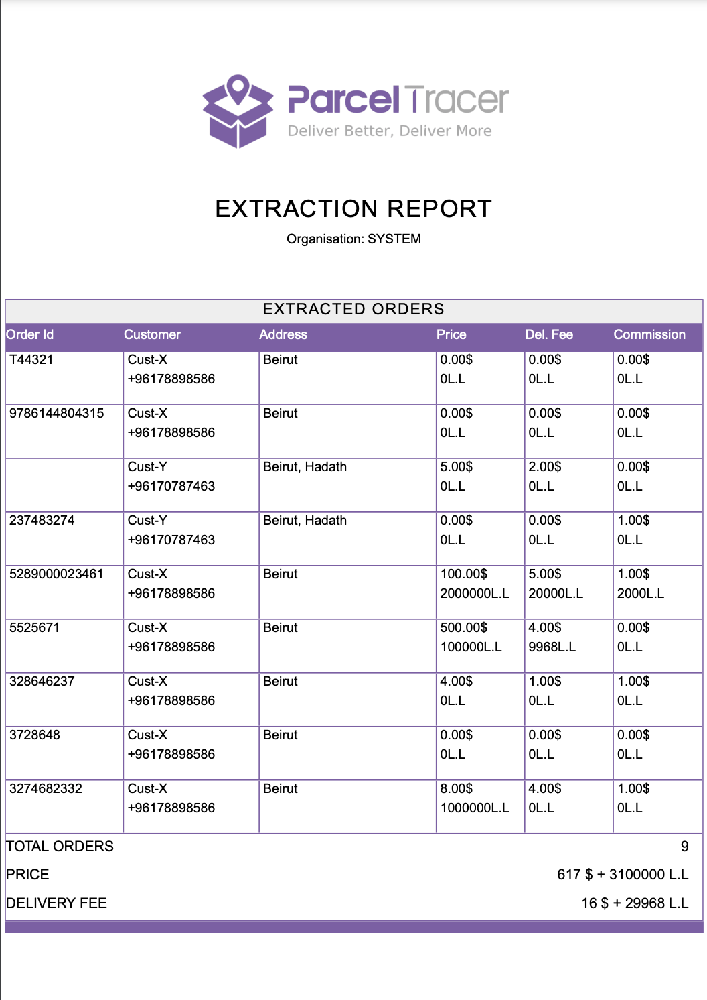

## Introduction

The orders page provides you with a table listing all your orders.

This table is also supported with a search and filter sections so that you can narrow down the order list based on specific criteria.

The following sections help discover the different functionalities that can help you list and search through your orders efficiently.

## Pagination

By default, the table shows you only 10 orders at a time.\
You can check the next (or previous) 10 orders by clicking the right (or left) arrow at the bottom right corner of the table.\
You can also change the number of orders that the table shows in 1 page by tweaking the page size at the bottom right corner.\
You are not able to view more than 250 orders at the same time.

The pagination controls are shown in the following figure:

## Searching and Filtering

Search and filtering controls allow you to narrow down the orders table based on a specific criteria.

The following sub-sections teach you how to apply filters and search queries.

### Search Controls

You are capable of searching based on the following fields:
- order id
- reference number
- customer name
- customer phone

A search query is composed of 3 items:
- search field: one of the 4 afore-mentioned fields
- matching type: either **contains** (for partial search) or **equals** (for exact search)
- search value

As an example, if you wish to search for the orders whose order id contains 122, you would do the following search:\
`Order_id` + `contains` + `122`\
Then you click the search button to obtain the result.

If you want to get the orders whose customer has the phone number `70787463`, you would do the following query:\
`Customer_phone` + `equals` + `70787463`\
Then you click the search button to obtain the result.

The video below shows you how you can search by order id and by customer name.

<iframe 
  width="100%" 
  height="400" 
  src="https://www.youtube.com/embed/eY7PJq-I_Yk" 
  title="YouTube video player" 
  frameborder="0" 
  allow="accelerometer; autoplay; clipboard-write; encrypted-media; gyroscope; picture-in-picture" 
  allowfullscreen>
</iframe>

### Date Controls

You can narrow down the orders list to a specific period by specifying a range for creation dates.

### Filtering Controls

Filtering controls can help combine multiple filters in order to show orders that adhere to specific criteria.

The possible criterion that you can combine are the following:
- Driver: show orders that are attached to a specific driver
- Merchant: show orders that are attached to a specific merchant
- Region: show orders that are sent to a specific region and/or governorate
- Delivery State: show orders with a specific delivery state
- Payment State: show orders with a specific payment state

Here is how you can apply these filters:
- To filter by driver, type `driver:` and then start typing the driver name or phone number
- To filter by merchant, type `merchant:` and then start typing the merchant name or phone number
- To filter by region, type `district:` (or `governorate:`) and then start typing the district (or governorate) name
- To filter by delivery state, type `delivery_state:` and then choose the delivery state from the dropdown list
- To filter by payment state, type `payment_state:` and then choose the payment state from the dropdown list

Once you start typing into the filters field, you will get some suggestions for filters that match your query.

<Tip>

### Hint

When typing a filter, partial names work.  
Typing `driver:sam` will show suggestions for all drivers whose names contain "sam".

</Tip>

#### Filtering Example

Suppose you are interested in listing the orders that are **Delivered** sent by merchant **Merch-X** to customers in **Baabda**.

In this case, you should apply the following filters:

`merchant:Merch-X`, `district:baabda`, `delivery_state:delivered`.

The following video shows you how easy it is to apply these filters.

<iframe 
  width="100%" 
  height="400" 
  src="https://www.youtube.com/embed/qafc5el-Ldg" 
  title="YouTube video player" 
  frameborder="0" 
  allow="accelerometer; autoplay; clipboard-write; encrypted-media; gyroscope; picture-in-picture" 
  allowfullscreen>
</iframe>

 

<Tip>

### Hint
Search, date and filters controls can be combined together to form complex filtering and searching. 

For example, you can look for orders that:
- are sent by merchant X
- are currently in transit
- were created between date d1 and date d2
- are with driver Y

In short, whatever you put in the search, date and filters get combined by the app to produce the correct result that adheres to what you are looking for.
</Tip>

## Tracking Links

Each order has a tracking link that is automatically assigned by the parcel tracer app.

You can get the tracking link of an order by clicking the copy-link button in the orders table as shown in the figure below

You can then share this tracking link with the customer or the merchant.

## Bulk Actions

The orders page allows you to select a group of orders and perform an action on them.

The actions that can be performed are the following:
- Modifying delivery state
- Modifying payment state
- Modifying the orders' branch
- Assigning orders to a driver
- Deleting orders
- Printing orders in a pdf

To apply an action to a group of orders, you have to do the following:
- select the orders that you wish to apply the action on
- click the **Action** button, which will open a window
- select the action
- set the action details and click **Apply**

The following image shows how this should like:

<Warning>

### Pay Attention
If you are an employee (i.e. not an admin account), you might not have access to all actions described in this section.

The actions that you are allowed to do depend on the permissions with which the admin configured your account.
</Warning>

### Set Delivery State

This action allows you to change the delivery state of a group of orders with one click.

All what you have to do is to choose the **Set Delivery State** action, and then select the new delivery state that you wish to apply to the selected orders.

This is shown in the following figure:

There are few things that you need to pay attention to when setting the delivery states of orders:
- Applying this action will reset the payment state of the selected orders to **Uninvoiced**.
- You can't change the delivery state to a value that makes the order state inconsistent. The following actions are not allowed:
    - Setting delivery state to anything but **Pending** for an order that has not been assigned an order id yet. This can happen for orders that were created by merchants without any order id.
    - Setting delivery state to **In Transit** or **Delivered** when the order is not assigned to a driver yet.

### Set Payment State

This action allows you to change the payment state of a group of orders with one click.

All what you have to do is to choose the **Set Payment State** action, and then select the new payment state that you wish to apply to the selected orders.

This is shown in the following figure:

<Warning>

### Pay Attention

The application doesn't allow you to set the payment state to **Invoiced For Driver** or **Invoiced For Merchant** if one of the selected orders is not yet in a final state (i.e. delivered or cancelled).
</Warning>

<Warning>

### Pay Attention

Setting payment state as a bulk action will not create any invoices.

If you wish to generate invoices for paid orders, you should use the **Accounting** page.

This action should be used when you have to fix some errors in order states.

For example, if you included some orders by mistake in a driver's invoice and you want to revert the payment state to uninvoiced, you can use this option.
</Warning>

### Set Branch

This action is similar to previous actions.

It is useful to assign a group of orders to a specific branch.

### Assign Driver

This action allows you to assign a group of orders to a specific driver as you can see in the figure below.

As you can see in the figure, you need to specify the following:
- The driver: you can search for a driver by typing his name or phone number
- The driver commission in L.L and in $

<Warning>

### Pay Attention

You are not allowed to assign orders to a driver if:
- one of the orders is not approved yet
- one of the orders is already **Invoiced For Driver** or **Invoiced For Merchant**

Once you assign orders to a driver, the delivery state of the orders will become **In Transit**.
</Warning>

### Delete Order

This action allows you to delete the selected orders.

<Warning>
This action is not reversible.

Deleted orders can't be restored.
</Warning>

### Extract As PDF

This action allows you to extract the selected orders data in a PDF file.

The data are organised in a table.

At the end of the document, you will have a small summary including:
- Total Orders: this is the total number of orders that were printed
- Price: this is the sum of prices of all printed orders.
- Delivery Fee: this is the sum of all delivery fees of all printed orders.

The figure below shows an example of what the extraction report can contain:

