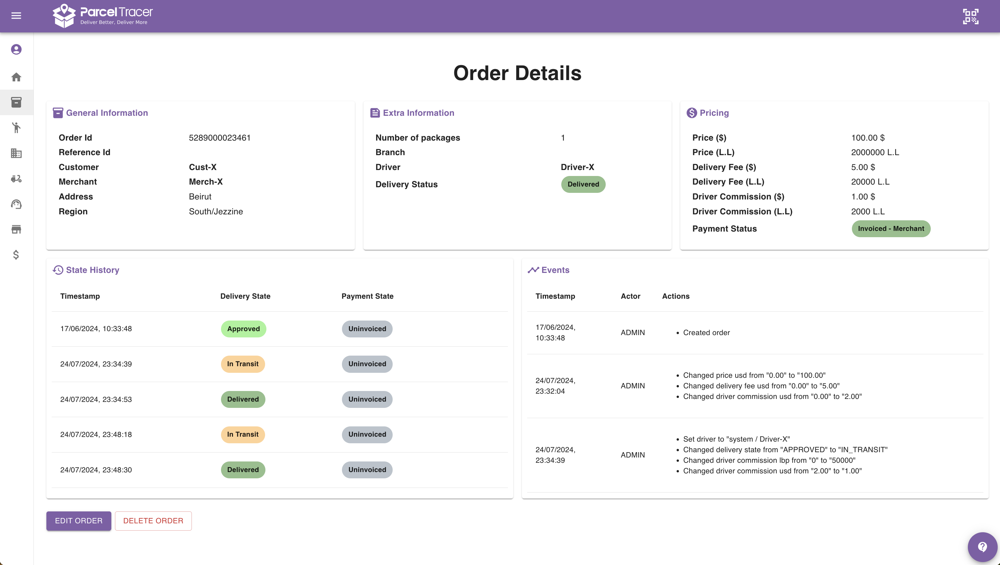

## Order Details Page

Order details page shows you exhaustive information about your order.

If you are an admin, you will also be able view on changelog of all the actions that took place on the order since it was created.

Here is an example of what the order details page can look like:

## State History

The state history section shows you the different delivery/payment states that the order has been through.

It also specifies the date and time for each state.

This can be useful to track any errors on the system.

Check the image above to see examples of this.

## Events

<Warning>
The order events section is only visible to admin accounts.

</Warning>

The order events section show you all actions that took place on the order.

Each row shows the following:
- Timestamp: date and time at which the action took place
- Actor: The account that took this action (e.g. admin, employee X, employee Y)
- Actions: The set of actions that were applied to the order.

Each action shows you the previous value and the new value of the modified order fields.

Check the image above to see examples of this.
