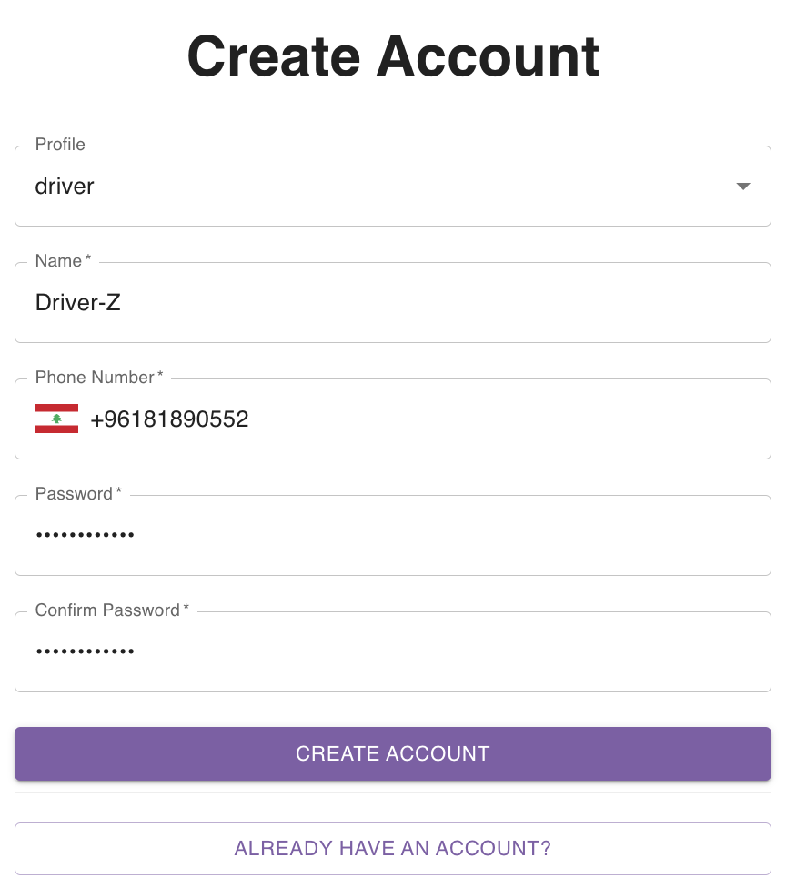
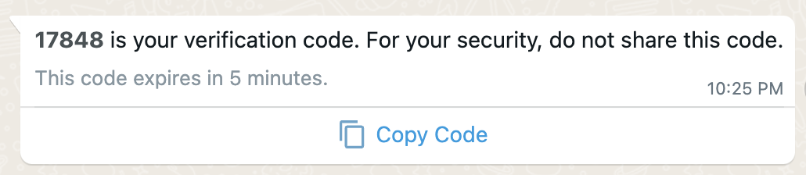
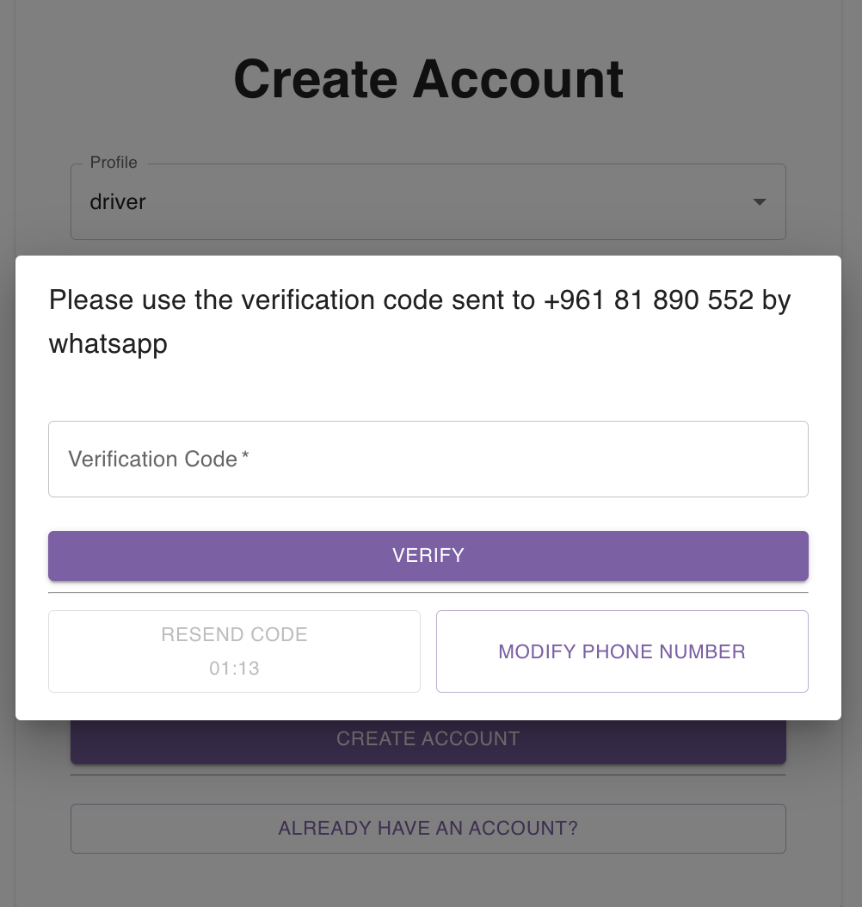

## Creating a Driver Account

As a delivery driver, you can create a driver account on parcel tracer for free by navigating to parceltracer's [signup page](https://parceltracer.app/signup).

You will see a form that requires you to fill the following information:
- Name
- Phone Number [**make sure the phone number is correct because you will receive a verification code by whatsapp to create the account**]
- Password
- Password Confirmation

You can see this in the following figure:

Once you submit the form, you will receive a message by whatsapp with a verification code as you can see in the figure below:

You should enter the verification code to validate the creation of your account:

In case you didn't receive the code, you can request sending another code after 2 minutes.

If the issue persists, please [contact us](https://wa.me/+33753560667).

Once you have validated your account, you can login [here](https://parceltracer.app/login).