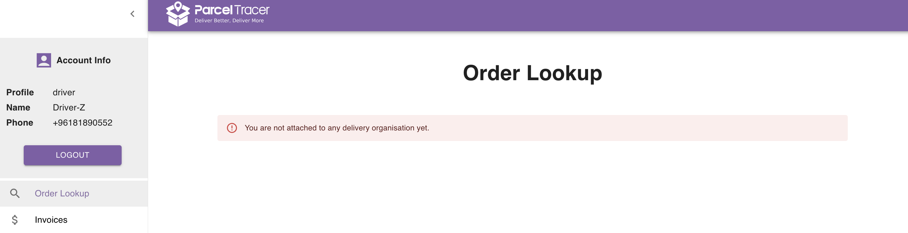
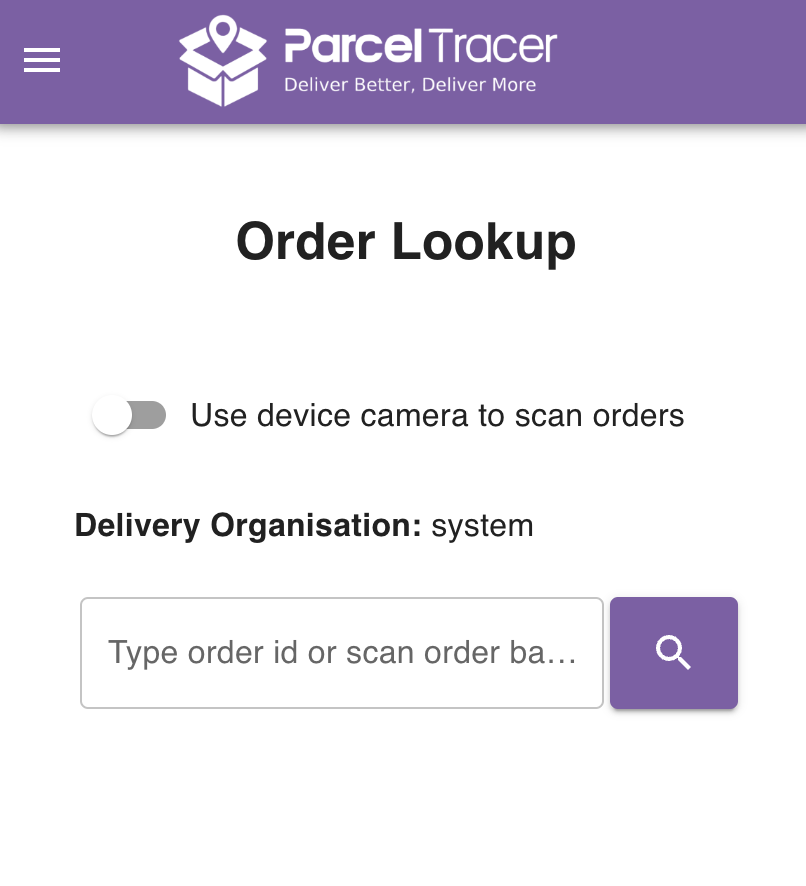
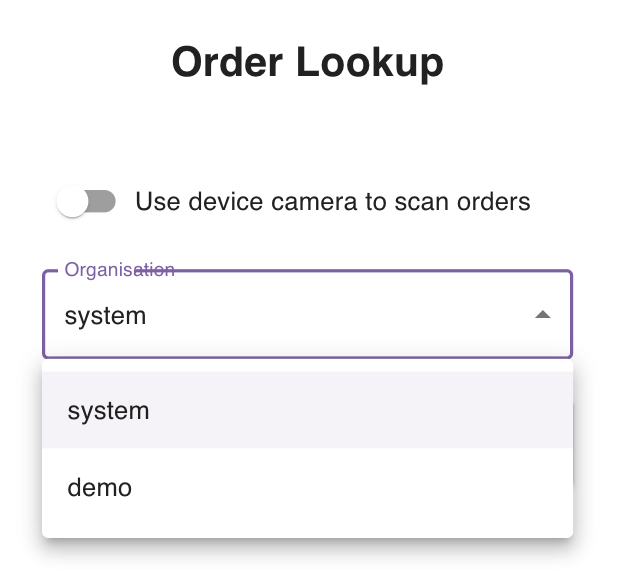

## Introduction

When you login to your parceltracer account for the first time, you will probably not be attached yet to any delivery organisation.

In this case, you will see a view similar to the following:

You can see the message saying that you are not attach to any delivery organisation yet.

## Joining a Delivery Organisation

To join a delivery organisation, ask the delivery organisation admin to add you to their organisation account in parcel tracer.

All you need is to provide your phone number to the admin.

You can help the admin by sharing [this link](/user-guides/for-delivery-companies/drivers/create-driver#adding-a-registered-driver) which explains how you can be added to the delivery organisation.

Once your account is added to a delivery organisation, the warning message should disappear and you should see something similar to the following view:

You can see now that you have joined the delivery organisation called **system**.

<Tip>

As a delivery driver, you can join more than one delivery organisation.

If you join multiple delivery organisations, you will be able to select which organisation you want to navigate directly from the account.

As an example, suppose that you joined another delivery organisation called **demo**, then you will see a drop down list to select the delivery org as you can see in the figure below:

The app will show you orders and invoices related to the selected delivery organisation only.
</Tip>