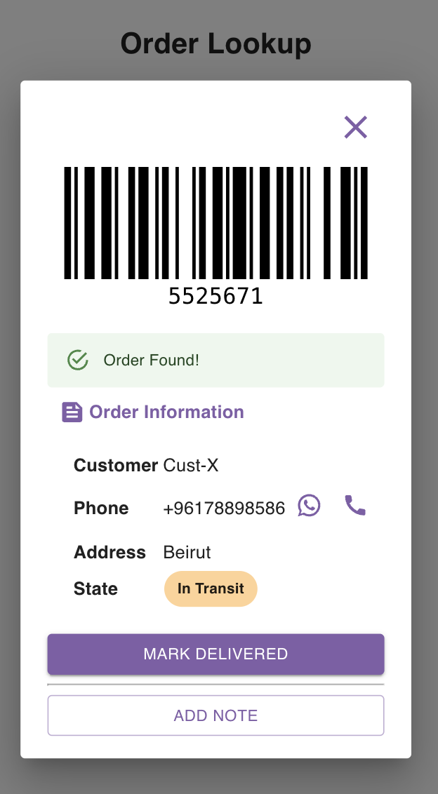

## Looking up your orders

Navigate to [order lookup page](https://parceltracer.app/driver-order-lookup).

Once you joing a delivery organisation, you can easily lookup an order that is assigned to you by:
- typing in the order id.
- scanning the order's barcode if the delivery organisation uses barcodes.

As an example, suppose that you have an order with the id **5525671**.

As you enter the order id into the search bar, you will get the order data as you can see in the figure below:

From here you can do the following actions:
- Mark order as delivered: by clicking the **MARK DELIVERED** button.
- Send a message to the delivery organisation: by clicking the **ADD NOTE** button.
- Open a whatsapp chat with the customer: by clicking the whatsapp icon.
- Dial the custom's phone number: by clicking the phone dial icon.