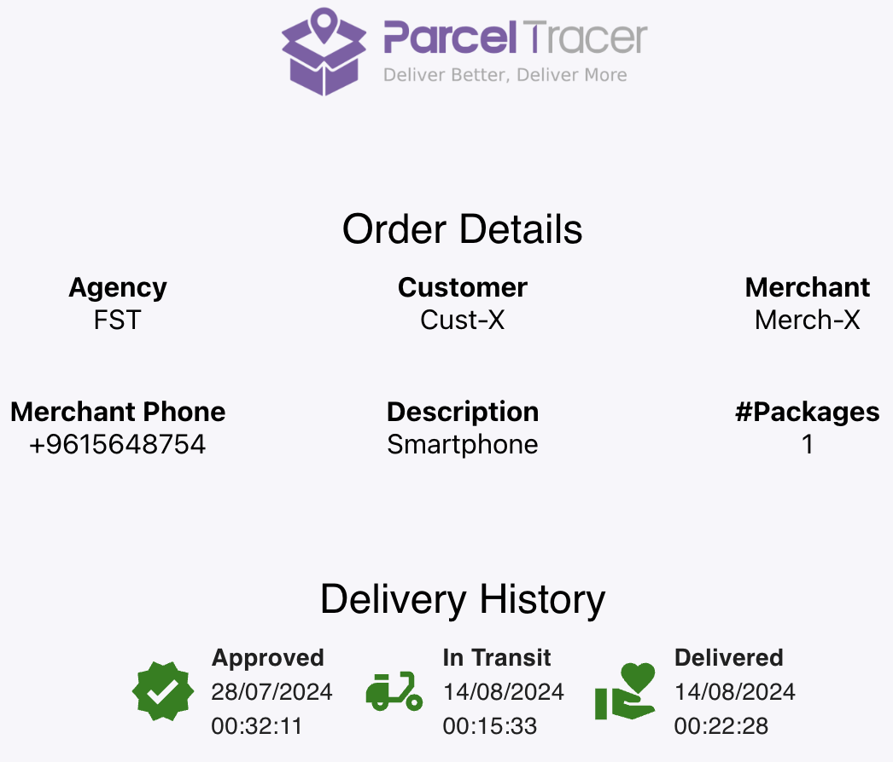

## Introduction

In parcel tracer, **Customers** are the recepients of orders sent by **Merchants** and delivered with **Delivery Organisations**.

## Tracking Orders

When you request the delivery of an order from a merchant that uses parceltracer, you can ask the merchant to provide you with a tracking link.

When you click to the tracking link, you should see the state and history of delivery of your order.

Here is an example of how this can look like:

In the figure above:
- **Agency**: is the name of delivery company that is delivering your order
- **Customer**: is the name of the recepient of the order
- **Merchant**: is the name of the sender of the order
- **Merchant Phone**: is the phone number of the order sender
- **Description**: is a brief description of the order
- **Packages**: is the number of packages contained in your order
- **Delivery History**: is a list of states that describes the history of the delivery of your order