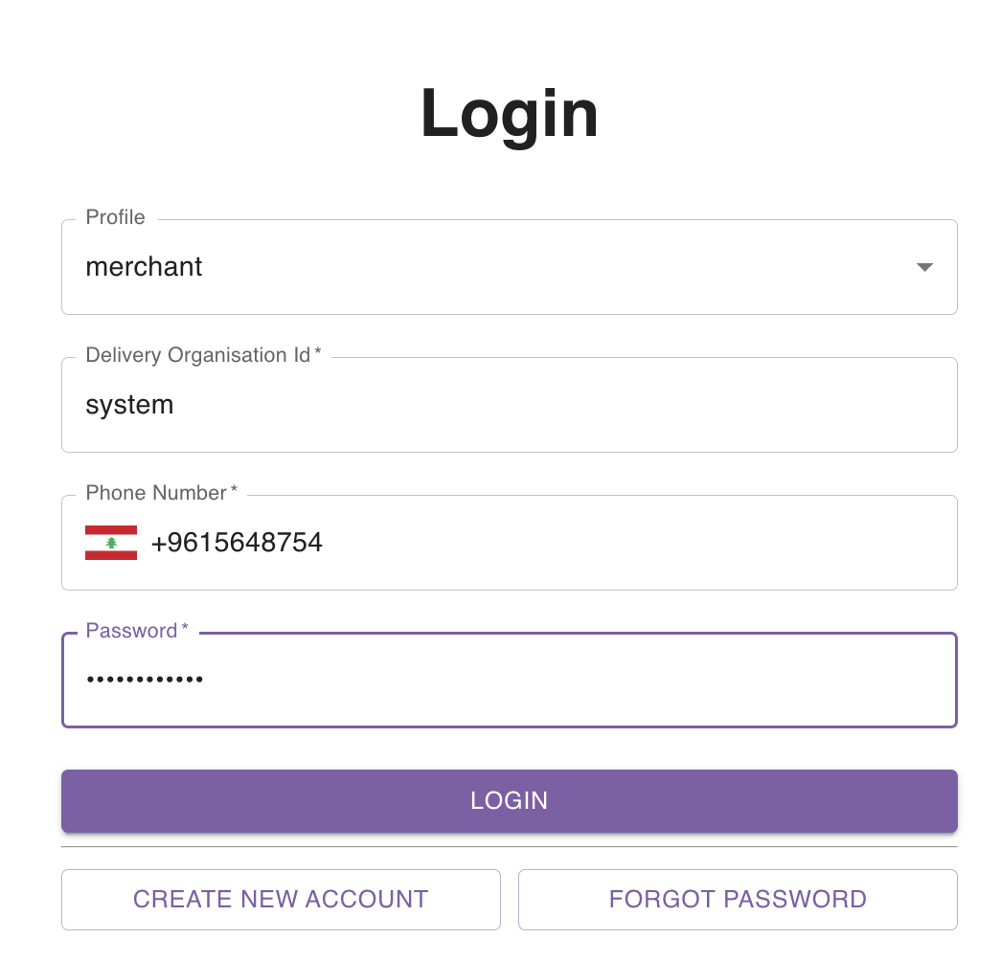

## Creating an account

A delivery company is referred to in parcel tracer as an **Organisation**.

As a merchant, to create an account, you should reach out to the delivery organisation admin and ask them to create a merchant account for you.

If they are not sure how to do so, you can help out by sharing [this link](/user-guides/for-delivery-companies/merchants/create-merchant#create-merchant-from-merchants-page) that explains how this can be done.

## Logging in to your account

In order to login to your merchant account, navigate to [parceltracer](https://parceltracer.app/) sign in page.

Fill in the form as follows:
- Profile: Merchant
- Delivery Organisation Id: this is the id of the delivery organisation that created your account. You can ask the admin to provide you with this id.
- Phone Number: your phone number
- Password: the account password which was provided to you by the delivery organisation that created the account for you.

The figure below shows you an example of this:

