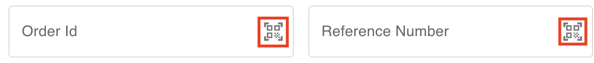

## Introduction

It is possible to create a new order by filling the create order form.

You also have the barcode scanning feature at your disposal to speed up filling the order id and/or reference number.

In case you have many orders to add, you can organise the data in CSV file and create the orders by few clicks by uploading the file to parcel tracer.

<Tip>
You can attach a barcode scanner device to your laptop and scan barcodes on the fly!\
If you wish to obtain a laser barcode scanner, don't hesitate to contact us.
</Tip>

## Filling An Order Form

Navigate to the [orders page](https://parceltracer.app/merchant-orders) in the app and click the **CREATE NEW** button.

This will open a side drawer from the right and show you a form that you can use to fill the order data.

Here are some useful tips:
- **Order Id** can be left empty when creating an order
- **Reference Number** is optional and can be used as an id related to your internal store as a merchant
- To search for a customer, you can start by typing their name or phone number.
- If the order is for a new customer, you can click the plus sign to add the customer information.
- The address and district will be automatically filled when you choose the customer, but you can still change them if needed.
- You can click the scan icon in the order id (or reference number) field to use your phone camera to scan a barcode and automatically the field.

The following video shows an example of how the form can be filled.

<iframe 
  width="100%" 
  height="400" 
  src="https://www.youtube.com/embed/akPnjsAIMBU" 
  title="YouTube video player" 
  frameborder="0" 
  allow="accelerometer; autoplay; clipboard-write; encrypted-media; gyroscope; picture-in-picture" 
  allowfullscreen>
</iframe>

## Scanning A Barcode

To make things easier and faster for you, we provide you with a barcode scan functionality.

In the create order form, you can see the barcode scanner icons in the **Order Id** and the **Reference Number** fields:

You can click these icons to open the device camera and scan the order id (or reference number) directly from a barcode.

## Creating Multiple Orders with CSV File

Some merchants might need to place a large number of orders on the parcel tracer app.

If you fall into this category, we advice you to setup your orders in a csv file following the conventional format followed by parcel tracer and upload the file so that orders are created with one click.

Head to the [orders page](https://parceltracer.app/merchant-orders) and click **CREATE USING CSV**.

If it is your first time, click **DOWNLOAD TEMPLATE CSV** to download a csv file that explains how data should be organised.

You can also download this template by clicking [here](https://drive.google.com/u/0/uc?id=1IbDlaEfGvTpq4KldYFnQVxMZtMyYOKUD&export=download).

The following video shows you how to upload a csv file in order to create a group of orders with few clicks.

The csv used in this video is inspired from the initial template mentioned above.

The file used in the video can be downloaded from [here](https://drive.google.com/u/0/uc?id=1jEPJEAYKnlq7okdv7cJOYC8LOPQutZnV&export=download).

<iframe 
  width="100%" 
  height="400" 
  src="https://www.youtube.com/embed/QfoHEXbG_YE" 
  title="YouTube video player" 
  frameborder="0" 
  allow="accelerometer; autoplay; clipboard-write; encrypted-media; gyroscope; picture-in-picture" 
  allowfullscreen>
</iframe>

 
<Warning>
How are customer data treated in the CSV file?

The customer is identified by phone number.

For each order, if there is no customer with the indicated phone number, parceltracer will automatically create the customer for you and set all data as needed.

If a customer with the same phone number exists in the system, parcel tracer will update the customer information (name, district, address, etc.) with the data indicated in the CSV file and assign the order to the existing customer.
</Warning>
