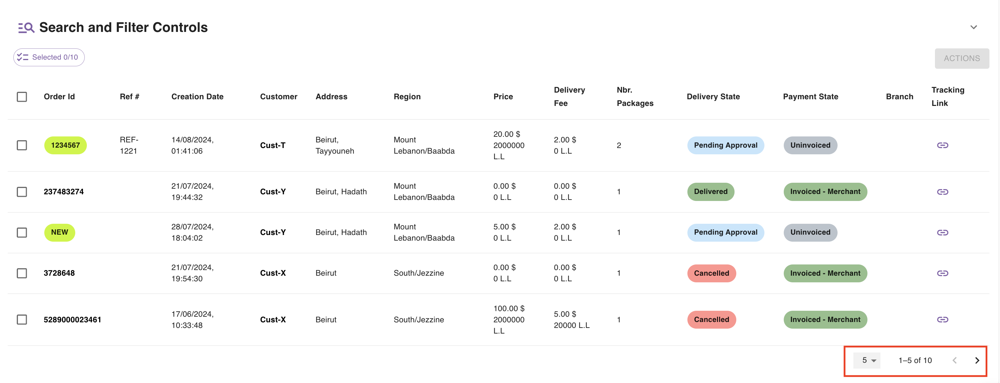
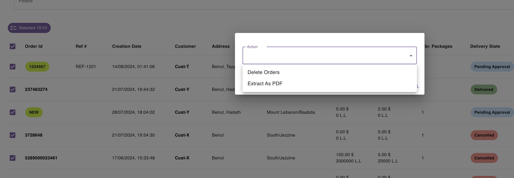
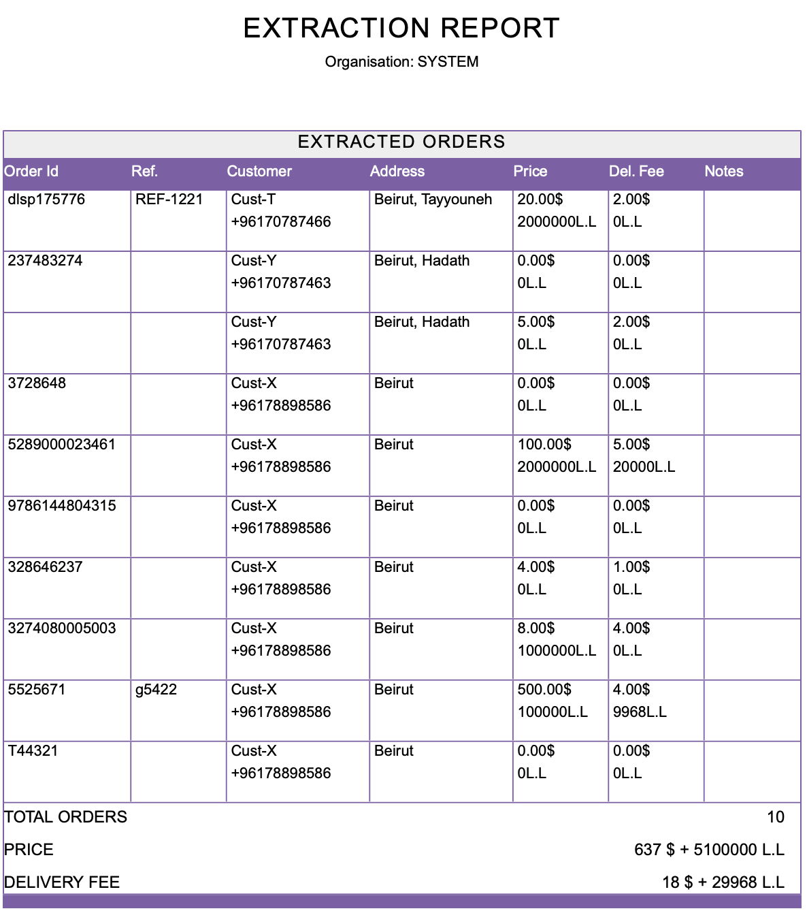

## Introduction

The [orders page](https://parceltracer.app/merchant-orders) provides you with a table listing all your orders.

This table is also supported with a search and filter sections so that you can narrow down the order list based on specific criteria.

The following sections help discover the different functionalities that can help you list and search through your orders efficiently.

## Pagination

By default, the table shows you only 10 orders at a time.\
You can check the next (or previous) 10 orders by clicking the right (or left) arrow at the bottom right corner of the table.\
You can also change the number of orders that the table shows in 1 page by tweaking the page size at the bottom right corner.\
You are not able to view more than 250 orders at the same time.

The pagination controls are shown in the following figure:

<Tip>

Orders that are still in the pending approval state have an order id with a light green background.

</Tip>

## Searching and Filtering

Search and filtering controls allow you to narrow down the orders table based on a specific criteria.

The following sub-sections teach you how to apply filters and search queries.

### Search Controls

You are capable of searching based on the following fields:
- order id
- reference number
- customer name
- customer phone

A search query is composed of 3 items:
- search field: one of the 4 afore-mentioned fields
- matching type: either **contains** (for partial search) or **equals** (for exact search)
- search value

As an example, if you wish to search for the orders whose order id contains 122, you would do the following search:\
`Order_id` + `contains` + `122`\
Then you click the search button to obtain the result.

If you want to get the orders whose customer has the phone number `70787463`, you would do the following query:\
`Customer_phone` + `equals` + `70787463`\
Then you click the search button to obtain the result.

The video below shows you how you can search by order id, by reference number and by customer name

<iframe 
  width="100%" 
  height="400" 
  src="https://www.youtube.com/embed/5tbnk6UUQRI" 
  title="YouTube video player" 
  frameborder="0" 
  allow="accelerometer; autoplay; clipboard-write; encrypted-media; gyroscope; picture-in-picture" 
  allowfullscreen>
</iframe>

### Date Controls

You can narrow down the orders list to a specific period by specifying a range for creation dates.]

### Filtering Controls

Filtering controls can help combine multiple filters in order to show orders that adhere to specific criteria.

The possible criterion that you can combine are the following:
- Region: show orders that are sent to a specific region and/or governorate
- Delivery State: show orders with a specific delivery state
- Payment State: show orders with a specific payment state

Here is how you can apply these filters:
- To filter by region, type `district:` and then choose the district from the dropdown list
- To filter by delivery state, type `delivery_state:` and then choose the delivery state from the dropdown list
- To filter by payment state, type `payment_state:` and then choose the payment state from the dropdown list

Once you start typing into the filters field, you will get some suggestions for filters that match your query.

#### Filtering Example

Suppose you are interested in listing the orders that are **Delivered** to customers in **Baabda**.

In this case, you should apply the following filters:

`district:baabda`, `delivery_state:delivered`.

The following video shows you how easy it is to apply these filters.

<iframe 
  width="100%" 
  height="400" 
  src="https://www.youtube.com/embed/DyF87D5MW-s" 
  title="YouTube video player" 
  frameborder="0" 
  allow="accelerometer; autoplay; clipboard-write; encrypted-media; gyroscope; picture-in-picture" 
  allowfullscreen>
</iframe>

 
<Tip>
Search, date and filters controls can be combined together to form complex filtering and searching. 

For example, you can look for orders that:
- are currently in transit
- were created between date d1 and date d2
- are with sent to district d

In short, whatever you put in the search, date and filters get combined by the app to produce the correct result that adheres to what you are looking for.
</Tip>

## Tracking Links

Each order has a tracking link that is automatically assigned by the parcel tracer app.

You can get the tracking link of an order by clicking the copy-link button in the orders table as shown in the figure below

You can then share this tracking link with the customer or the merchant.

## Bulk Actions

The orders page allows you to select a group of orders and perform an action on them.

The actions that can be performed are the following:
- Deleting orders
- Printing orders in a pdf

To apply an action to a group of orders, you have to do the following:
- select the orders that you wish to apply the action on
- click the **Action** button, which will open a window
- select the action
- set the action details and click **Apply**

The following image shows how this should like:

### Delete Order

<Warning>

Once an order is approved, you can't delete anymore from the system.

If you want to cancel the order, contact the delivery company.

</Warning>

This action allows you to delete the selected orders.

This action is only possible for orders that are still in the **Pending Approval** state.

### Extract As PDF

This action allows you to extract the selected orders data in a PDF file.

The data are organised in a table.

At the end of the document, you will have a small summary including:
- Total Orders: this is the total number of orders that were printed
- Price: this is the sum of prices of all printed orders.
- Delivery Fee: this is the sum of all delivery fees of all printed orders.

The figure below shows an example of what the extraction report can contain:

