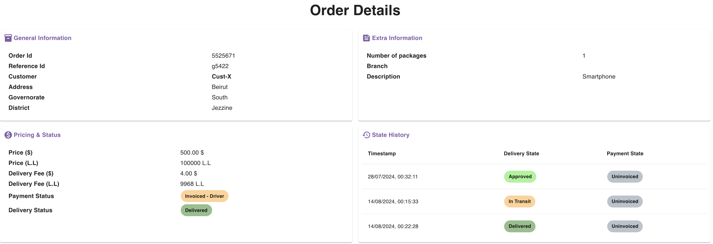

## Order Details Page

Order details page shows you exhaustive information about your order.

Here is an example of what the order details page can look like:

<Warning>

You can delete/modify the order as long as it is in the **Pending Approval** state.

Once it is already approved, you can no longer delete or modify the order yourself.

If necessary, you can reach out to the delivery organisation to make any required modification and/or cancellation.

</Warning>

## State History

The state history section shows you the different delivery/payment states that the order has been through.

It also specifies the date and time for each state.

This can be useful to track any errors on the system.

Check the image above to see examples of this.